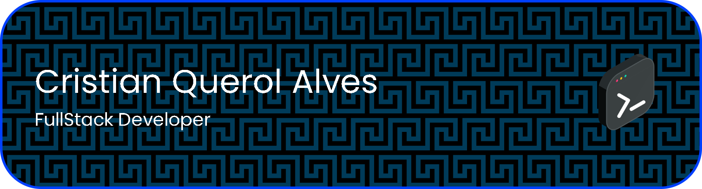

📲 Conecta conmigo:  

  
  
  
  
  

# 👋 ¡Hola! Soy Cristian Querol Alves

Soy estudiante de **Informática de Oficina** en **La Salle Barceloneta**, apasionado por la tecnología, la productividad digital y la innovación en entornos de oficina. Me encanta aprender de manera práctica y aplicar mis conocimientos para mejorar procesos y optimizar tareas mediante herramientas digitales.  

## 🚀 Sobre mí
- 💻 Apasionado por la **automatización de tareas** y la optimización de procesos de oficina.  
- 📊 Experiencia básica en **gestión de datos**, hojas de cálculo y bases de datos simples.  
- 🌱 Aprendiendo constantemente **HTML, CSS, JavaScript** y herramientas ofimáticas avanzadas.  
- 🤝 Motivado para **colaborar en proyectos** que combinen tecnología y productividad.  
- 🎯 Curioso, creativo y enfocado en **mejorar habilidades digitales día a día**.  

## 🛠 Habilidades
- **Ofimática:** Microsoft Office (Word, Excel, PowerPoint), Google Workspace  
- **Programación avanzada:** HTML, CSS, JavaScript  
- **Bases de datos:** MySQL, SQLite  
- **Otros:** Git básico, Linux, automatización de tareas, vpn's

## 📫 Contacto
- ✉️ Email: cristianquerol7@gmail.com
- 🌐 Moon Vision: [Únete](https://discord.gg/HtJ8uMQBed)  
- 🐙 GitHub: [cristianquerolalves1](https://github.com/cristianquerolalves1/)

## ⚡ Dato curioso
Me encanta explorar nuevas herramientas digitales, aprender de proyectos reales y encontrar soluciones creativas que faciliten la vida diaria en entornos de oficina.

<!-- Proudly created with GPRM ( https://gprm.itsvg.in ) -->
